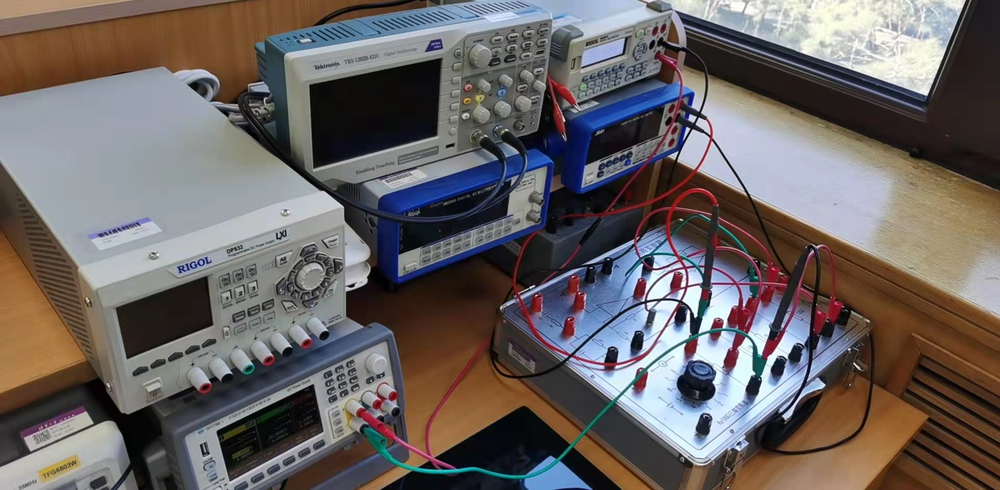
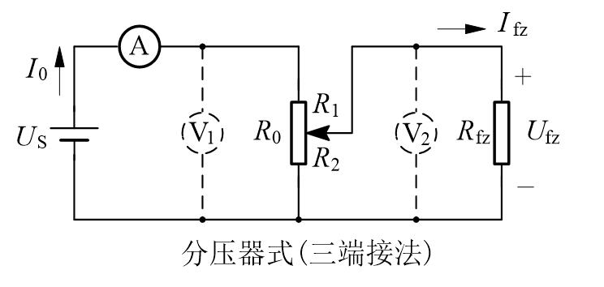
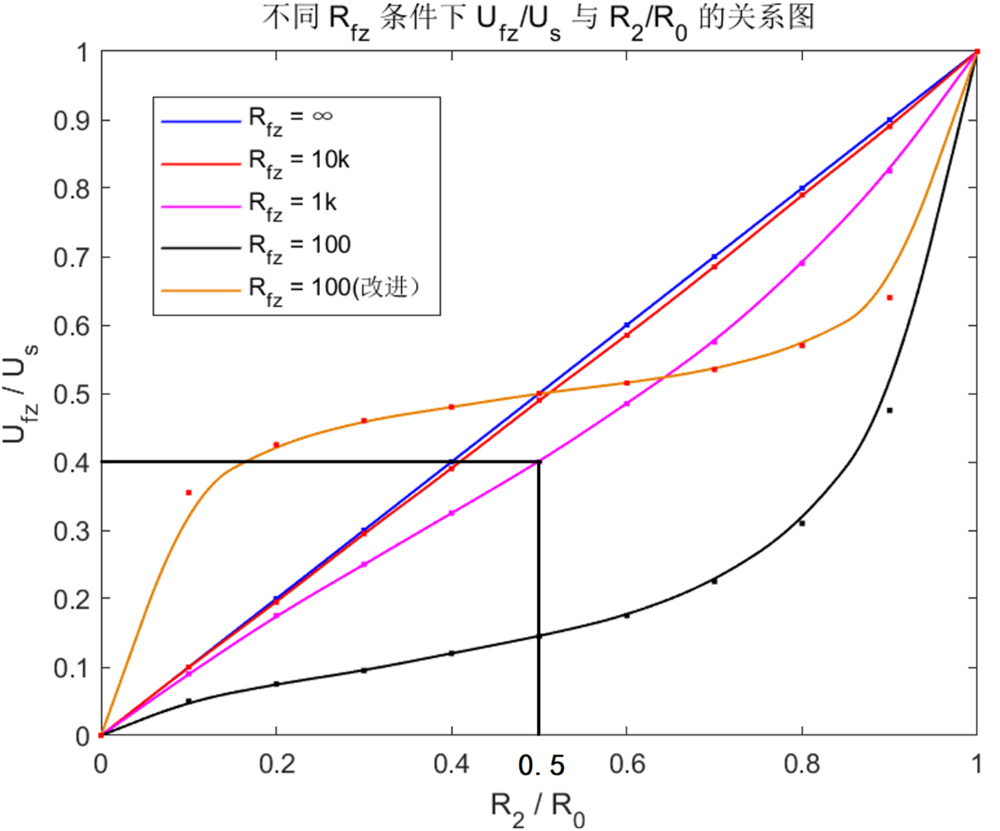
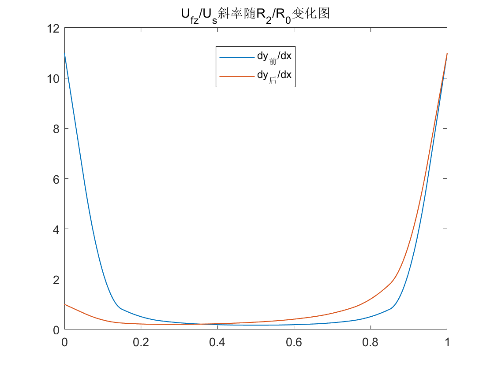
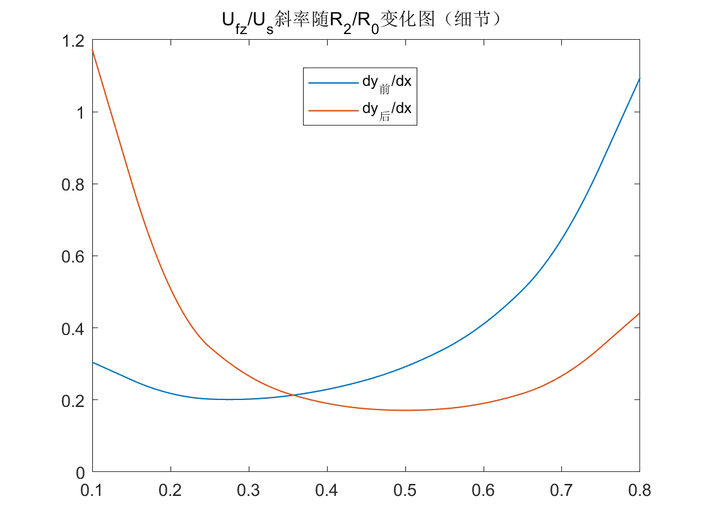
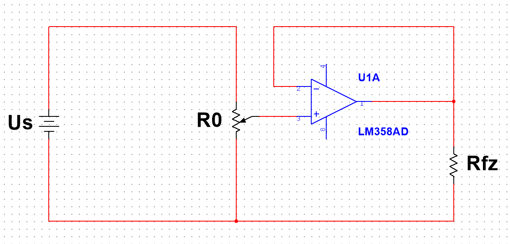
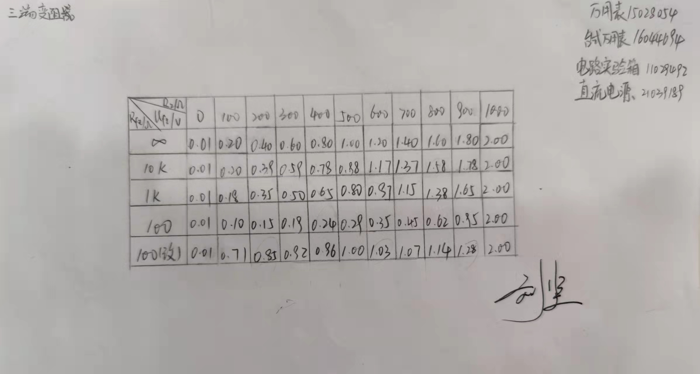

   

#
<big>三端变阻器实验报告
    

  

###**
 自动化系**
###**
 李昭阳 2021013445**

##实验仪器与电路图
&ensp;&ensp;&ensp;
本次实验使用了万用表15028054、台式万用表16044694、电路实验箱11029492、直流电源21039189。并采用如下电路原理图[1]进行了四组不同负载电阻（Rfz）条件下，负载电压（Ufz）与三端变阻器并联入负载端的阻值（R2）的关系。
 

&ensp;&ensp;&ensp;
由于此电路图所示实际电路在较小负载电阻（Rfz = 100Ω）时三端变阻器调压效果不理想，故采用改进电路图[2]如下。
  

&ensp;&ensp;&ensp;
进行电路的改进后，不仅获得了更好的调压效果，还使得所绘制图像的线性性更强。（详见实验结果与数据分析）

##实验结果与数据分析

**本次实验的原始数据**
  

&ensp;&ensp;&ensp;
在本次实验过程中，三端变阻器各档位电阻差为100Ω，最大电阻为1000Ω。同时，三端变阻器在与电源相连的两端始终保持Us = 2V，故对其进行归一化处理得到如下结果。
  

**原始数据的归一化处理**
  

&ensp;&ensp;&ensp;
对归一化后的数据进行曲线拟合（拟合曲线不经过所有数据点），得到如下曲线。
  

  
&ensp;&ensp;&ensp;
由图可知，为使调压特性在R2/R0 = 0.5时，Ufz/Us > 0.4，Rfz/R0 > 1.0。其理论推导如下：
 
干路电流 I = \\(\frac{U_s}{R_1&ensp;+&ensp;\frac{{R_2R_fz}}{R_2&ensp;+&ensp;R_fz}}\\)，又因为R2/R0 = 0.5，所以
 

$$\frac{U_s}{U_fz} =  \frac{R_2R_fz}{R_0(R_fz+R_2)-R_2^2}$$

又因为Ufz/Us > 0.4， 则上式 > 0.4，解得Rfz/R0 > 1
##实验结论

###改进前电路

&ensp;&ensp;&ensp;
此类电路对于大负载（Rfz/R0 ≥ 10)有较好的调压性能，即当负载端趋近于断路时，Ufz/Us与R2/R0成近似的线性关系，且趋向程度越大，线性关系越明显。
 
&ensp;&ensp;&ensp;
当负载变为小电阻时（Rfz/R0 ≤ 0.1），若R2/R0 > 0.3，则调压对改变Ufz的作用不明显，解决此类问题可以选用改进的电路。

###改进后电路

&ensp;&ensp;&ensp;
此类电路对小负载（Rfz/R0 ≤ 0.1）调压效果较改进前更好，其原理是通过电桥将误差分散到了前后两部分，故对R2/R0 ≥ 0.3的部分有更好的调压性能。
 
&ensp;&ensp;&ensp;
但本电路在R2/R0 ＜ 0.3时调压效果较差，同时当R2趋向于0时，其线性性丢失严重，调压特性较改进前电路差。
##思考题
1.对于改进前电路，由前文（实验结果与数据分析）推导可知,
 

$$\frac{U_s}{U_fz} =  \frac{R_2R_fz}{R_0(R_fz+R_2)-R_2^2}$$

 
&ensp;&ensp;&ensp;
则令x = Ufz/Us，y = R2/R0，k = Rfz/R0,
 

$$y_前 = \frac{kx}{-x^2+x+k}$$

 
&ensp;&ensp;&ensp;
对其求微分可得，
 

$$\frac{\mathrm{dy_前}}{\mathrm{d}x} = \frac{kx^2+k^2}{(-x^2+x+k)^2}$$

 
&ensp;&ensp;&ensp;
对于改进后的电路，
 

$$\frac{U_s}{U_fz} =  \frac{\frac{R_2R_fz}{R_fz+R_2}}{\frac{R_2R_fz}{R_fz+R_2}+\frac{R_1R}{R_1+R}}$$

 
&ensp;&ensp;&ensp;
引入x，y，k，
 

$$y_后 = \frac{-x^2+(k+1)x}{-2x^2+2x+k}$$

 
&ensp;&ensp;&ensp;
对其求微分可得，
 

$$\frac{\mathrm{dy_后}}{\mathrm{d}x} = \frac{2kx^2-2kx+k^2+k}{(-2x^2+2x+k)^2}$$

 
&ensp;&ensp;&ensp;
对前后进行绘图，得

&ensp;&ensp;&ensp;
由于两个曲线在趋近于0和1时变化量过大，将x∈[0.1, 0.8]的区域放大进行绘图，得，
  

&ensp;&ensp;&ensp;
斜率的稳定程度代表Ufz/Us与R2/R0的线性程度，线性程度越高，代表调压效果越好。由图可知，与改进前的方案相比，改进后的方案在R2/R0趋向于0或1时调压效果较差，在R2/R0∈[0.3, 0.9]时调压效果较好。
  
2.由实验数据图可得，对于改进前电路而言，Rfz/R0越大时调压效果越好，所以为获得实用的调压效果，应当尽量使Rfz/R0趋近于无穷。
 
（以上两个思考题在实验结论部分已做过更为详细的解释）
##创新性思考
1.若调压效果不理想，是否有比改进型电路更为优越的电路选择？
 
&ensp;&ensp;&ensp;
在微电子电路的层面上可以引入电压跟随器，在负反馈的作用下，R2改变不会使得干路总电阻变化（恒为R0），电压跟随器输出的电压与电源电压的比值（Ufz/Us）与R2/R0相等。
 
&ensp;&ensp;&ensp;
创新型电路的更大优势在于其电源内阻的分压始终不变，故在实验过程中可以避免对电压源的不断调整。

###**理论推导**

&ensp;&ensp;&ensp;
假设R2/R0 = a，
 

$$I_干 = \frac{U_s}{R_0}$$

 
&ensp;&ensp;&ensp;
则计算R2分得的电压得，
 

$$U_2 = \frac{R_2}{R_0}U_s$$

 
&ensp;&ensp;&ensp;
又因为U2 = Ufz，所以，
 

$$U_{fz} = \frac{R_2}{R_0}U_s = aU_s$$

 
&ensp;&ensp;&ensp;
即，
 

$$\frac{U_fz}{U_s} = \frac{R_2}{R_0} = a$$

 

###**创新型电路图**

**创新型电路图**
 
4、8端接入另一个外加电源（在本图中对主电路无影响故省略）

##实验感悟
&ensp;&ensp;&ensp;
通过本次实验，我了解了三端变阻器调压效果与Rfz/R0的关系，这将为我今后选用变阻器提供实验理论依据。同时我还通过改进电路了解了电路改进的思维方式，并且在微电子电路层面上创新出了自己对三端变阻器的改进方法。整体上，这次实验提升了我对电路原理的认识且锻炼了我创新性的思维，很有意义与趣味。
 
&ensp;&ensp;&ensp;
但在本次实验过程中出现过一些小失误。首先我事先对实验精度没有准确的估计，最开始时将数据精确至小数点后五位，造成了没有必要的运算，降低了效率。然后在实验初期也出现过思维的错误，如将（Us - U2）认定为Ufz（事实上Ufz = U2）。这些问题很快被我发现并进行了解决，但仍应提出自我批评以确保下次实验顺利进行。
##参考与引用
[1]《电路原理实验——三端变阻器》，李臻，2022
 
[2]《电路原理实验——三端变阻器》，李臻，2022
##附录：原始数据手写记录

