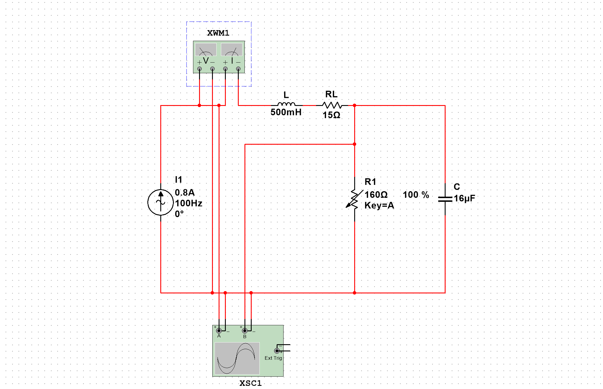
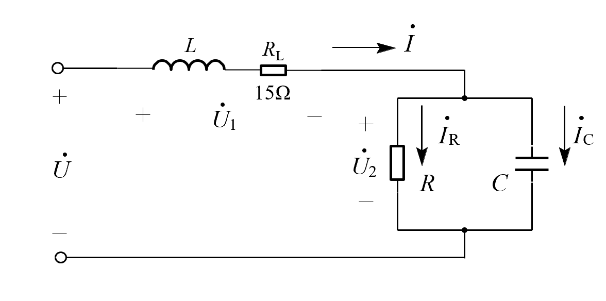
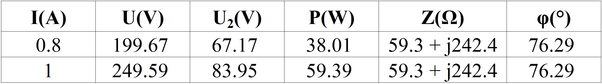
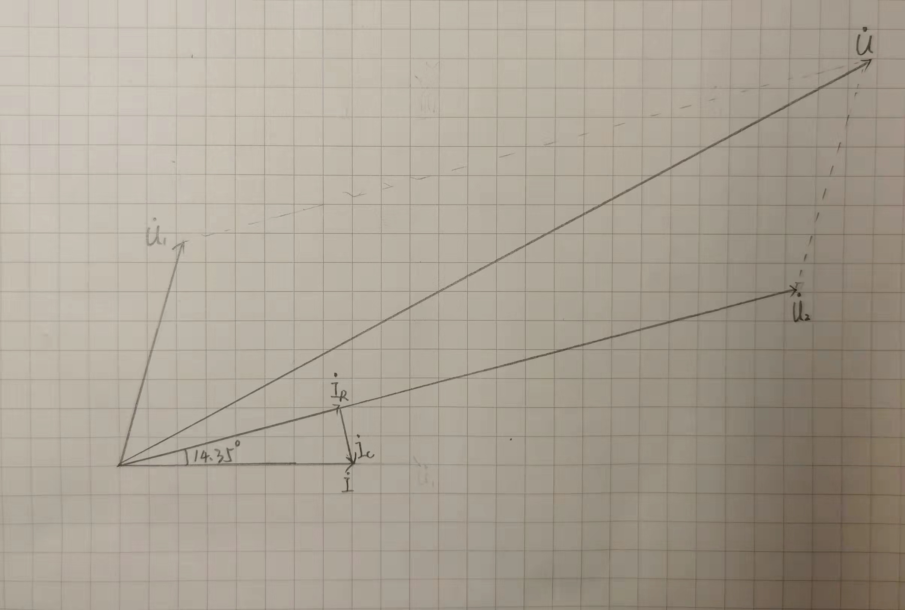

   

#
<big>交流电路参数测定实验报告
   

   

###**
 自动化系**
###**
 李昭阳 2021013445**

##实验说明与电路图
&ensp;&ensp;&ensp;
本次实验使用Multisim模拟软件，测定了电阻、电感、电容混合连接方式下的各类交流电路实验参数（\\(P、\dot{U}、\dot{U_2}\\)）。实验分为两组自变量，即在\\(I = 0.8A/1A\\)时进行测定，然后推算出总阻抗\\(Z\\)和阻抗角\\(\phi_0\\)。
 
&ensp;&ensp;&ensp;
本次实验使用的电路图如下。
 

##实验结果与数据分析

**本次实验的原始数据**
  

###说明：总阻抗\\(Z\\)和阻抗角\\(\phi_0\\)的推算
&ensp;&ensp;&ensp;
总阻抗\\(Z = \frac{U}{I}\\)。将阻抗分为阻性部分和抗性部分分别求解，则\\(R = \frac{P}{I^2}\\)，\\(X = \sqrt{Z^2 - R^2}\\)。
 
&ensp;&ensp;&ensp;
根据有功功率的计算公式，可得 \\(\phi_0 = arccos(\frac{P}{UI})\\)；在Multisim的实验环境下可以直接测得功率因数\\(Q\\)，那么可以直接得出 \\(\phi_0 = arccos Q\\)。

##思考题
###1.如果调压器的输入端、输出端接反了，会发生什么情况？
&ensp;&ensp;&ensp;
若使用前已归零，则自耦变压器副边匝数为0，即处于短路状态。此时将调压器的输入端和输出端接反，会导致输入电源火线零线短路。
 
&ensp;&ensp;&ensp;
若使用前未归零，将输入输出端接反后，\\(\dot{U} = \frac{n_主}{n_副}\dot{U_s}\\)，由于自耦变压器\\(\frac{n_主}{n_副} > 1\\)，那么\\(\dot{U} > \dot{U_s}\\)，后续工作电路会受到高于输入电压的冲击，可能由于高于额定电压而导致元件损坏。
 
###2.如何判断被测阻抗是容性还是感性？
&ensp;&ensp;&ensp;
可以在待测阻抗外并联一个合理的电容，观察并联电容前后干路电流的变化。若并联后电流减小，则待测阻抗为感性；若并联后电流增大，则待测阻抗为容性;若无明显变化，则待测阻抗为阻性。
###3.对于纯电阻、电感和电容元件，如何简化测量方式？
&ensp;&ensp;&ensp;
\\(\vert Z \vert = \frac{U}{I}\\)。对于纯电阻元件，\\(R = \vert Z \vert\\)；对于纯电感电容元件，\\(X = \vert Z \vert\\\)；对于纯电感电容元件，\\(X = -\vert Z \vert\\\)。可以省略瓦特计的测量。
##相量图绘制

##实验感悟
&ensp;&ensp;&ensp;
通过本次实验，我了解了交流电路参数测定的多种方法，在Multisim的模拟环境中取得了对电容、电感等元件的更深刻理解。同时我还思考了简化测量的方法与保证实验正确的小技巧，是值得记忆的一次模拟实验经历。
 
&ensp;&ensp;&ensp;
但在本次实验过程中未能接触到真实元件有些遗憾，同时我对Multisim的掌握程度还未达到熟练的状态，所以在搭建环境中花费了较多的时间。不过经此实验，我已经渐渐能更好地学习电路原理这门课程了。

